# Sentiment-Based Rating System

## Overview

This project aims to predict product ratings using natural language processing (NLP) techniques on customer reviews. By leveraging sentiment analysis, the system automatically assigns a rating score to each product based on the sentiment expressed in its reviews. The process involves text preprocessing, feature extraction, and machine learning model training to achieve accurate rating predictions.

Whether you're interested in understanding customer sentiment or improving product ratings, this project provides a robust framework for analyzing textual reviews and deriving actionable insights.

---

## Features

- **Automated Sentiment Analysis:** Uses NLP to analyze customer reviews and infer sentiment.
- **Product Rating Prediction:** Automatically assigns ratings based on review sentiment.
- **Image Handling:** Supports product and category images with Android components and libraries.
- **User Interaction:** Allows users to add products, reviews, update addresses, and interact with the system.
- **Database Integration:** Stores products, categories, reviews, and user data in a local SQLite database.
- **Modern Android App:** Built using AndroidX, navigation, image sliders, and more.
- **REST API Integration:** Uses external APIs (like Azure Cognitive Services) for sentiment analysis.

---

## Technologies Used

- **Java** (Android)
- **SQLite** (local database)
- **AndroidX** libraries
- **OkHttp** & **Gson** (REST API & JSON)
- **Glide** (image loading)
- **ImageSlideshow**, **android-ratingreviews**, **PayView** (UI components)
- **Azure Cognitive Services** (for sentiment analysis, configurable in code)

---

## Getting Started

### 1. Clone the Repository

```bash
git clone https://github.com/farmansunasara/Sentiment-Based-Rating-System.git
```

### 2. Open in Android Studio

- Import the project and allow Gradle to sync.
- All dependencies are defined in `build.gradle.kts` and `app/build.gradle.kts`.

### 3. Configure Sentiment Analysis API

- Update the API key and endpoint in `ReviewRatingDialog.java` for sentiment analysis.

### 4. Build & Run

- Build the project in Android Studio.
- Run on an emulator or physical device (Android).

---

## Project Structure

```
Sentiment-Based-Rating-System/
│
├── app/
│   ├── src/
│   │   └── main/
│   │       └── java/com/example/myapplication/
│   │           ├── Add_product_form.java         # Add products and images
│   │           ├── HomeFragment.java             # Displays products & categories
│   │           ├── ReviewRatingDialog.java       # Review submission & sentiment analysis
│   │           ├── MyDatabaseHelper.java         # Database operations
│   │           ├── UserProductAdaptor.java       # Product display adapter
│   │           ├── ProductAdaptor.java           # Product display adapter
│   │           ├── ImageModel.java               # Model for product images
│   │           ├── activityUser/                 # User activities (address, payment, etc.)
│   │           └── ...                           # More fragments & activities
│   ├── build.gradle.kts                          # Module dependencies
├── build.gradle.kts                              # Project dependencies
├── settings.gradle.kts                           # Project settings
├── images/                                       # Output and sample images
│   ├── sentiment_result.png
│   ├── product_rating.png
│   ├── review_submission.png
│   └── ... (add your images here)
└── README.md
```

---

## App Screenshots

<p align="center">
  
  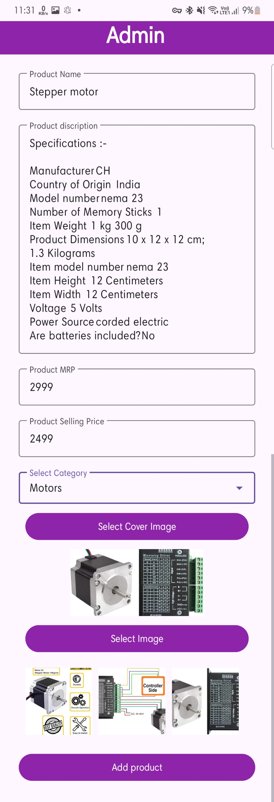
  
</p>
<p align="center">
  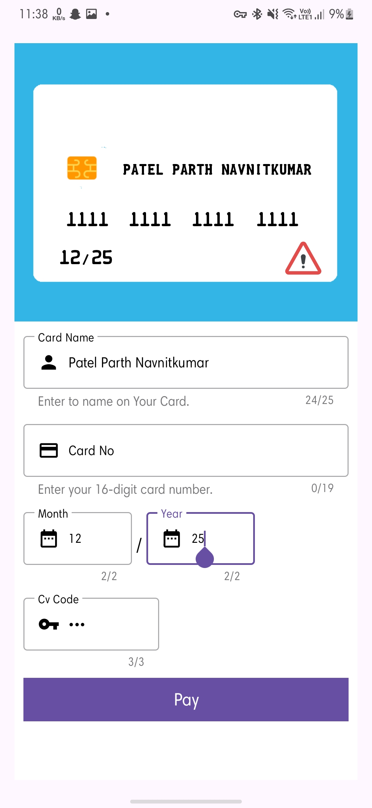
  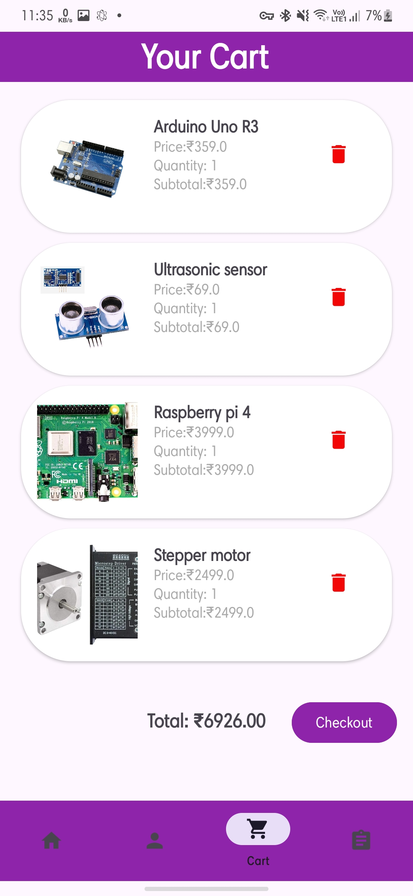
  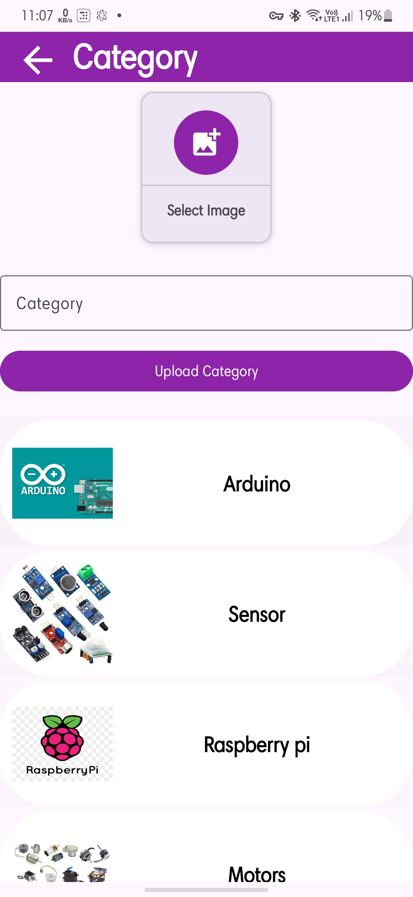
</p>
<p align="center">
  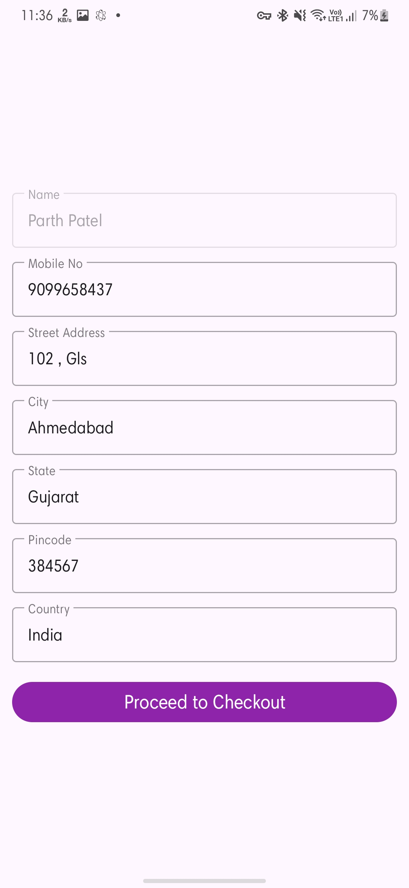
  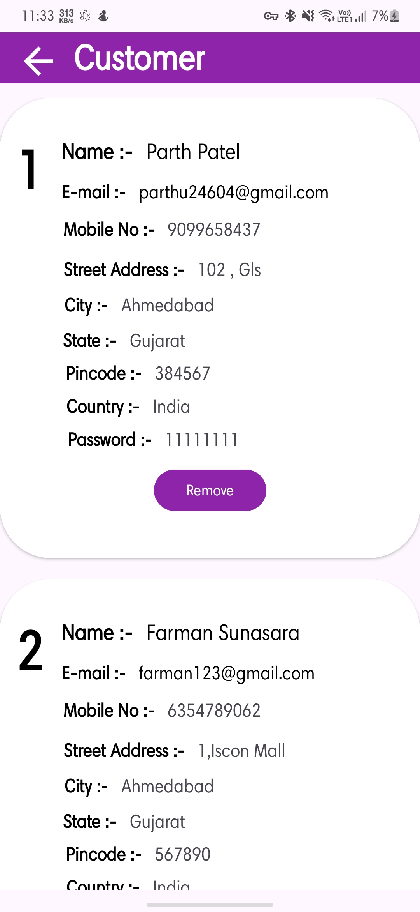
  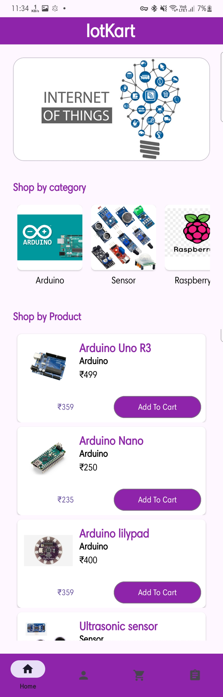
</p>
<p align="center">
  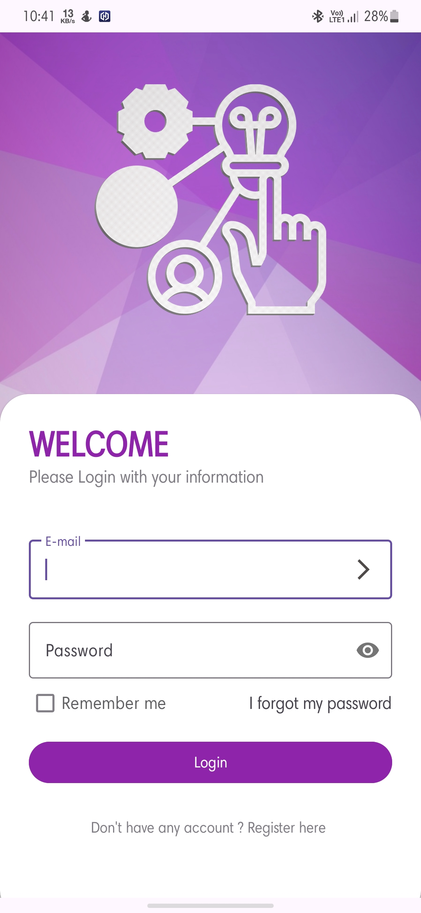
  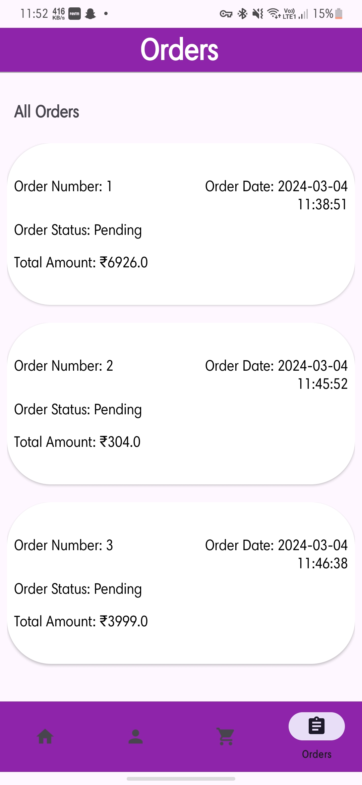
  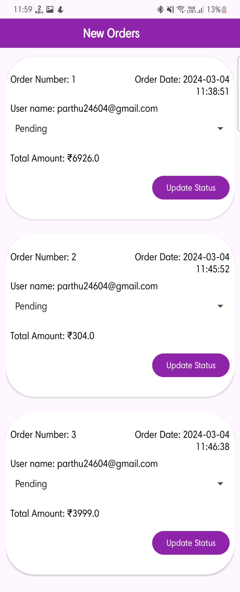
</p>
<p align="center">
  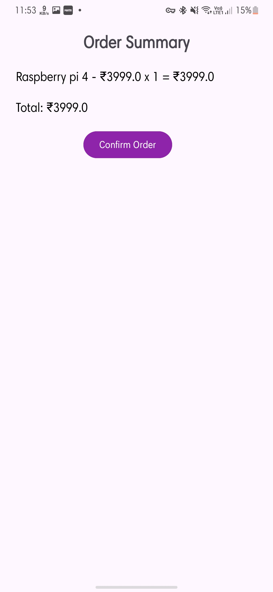
  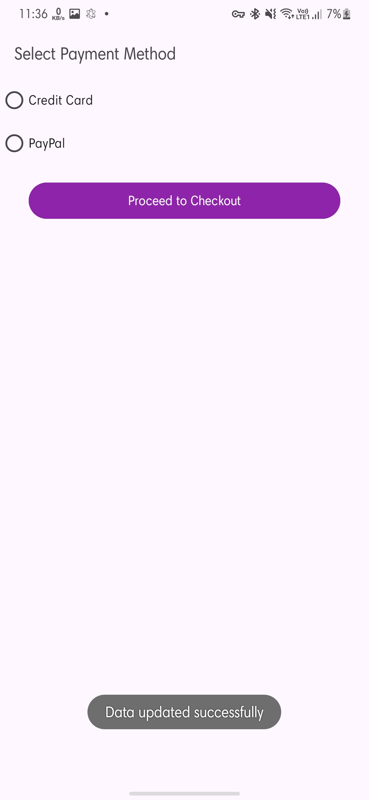
  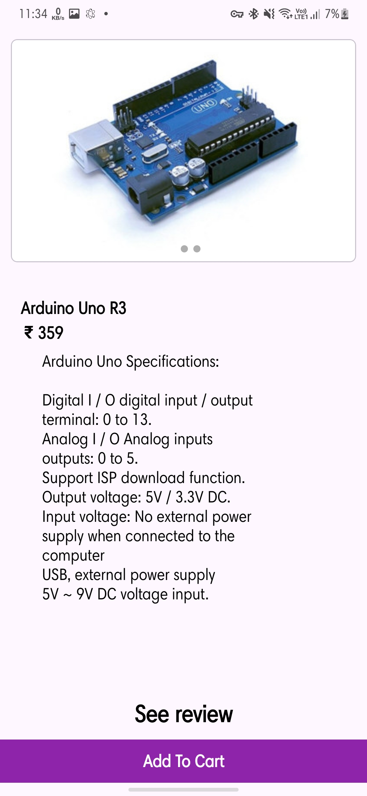
</p>
<p align="center">
  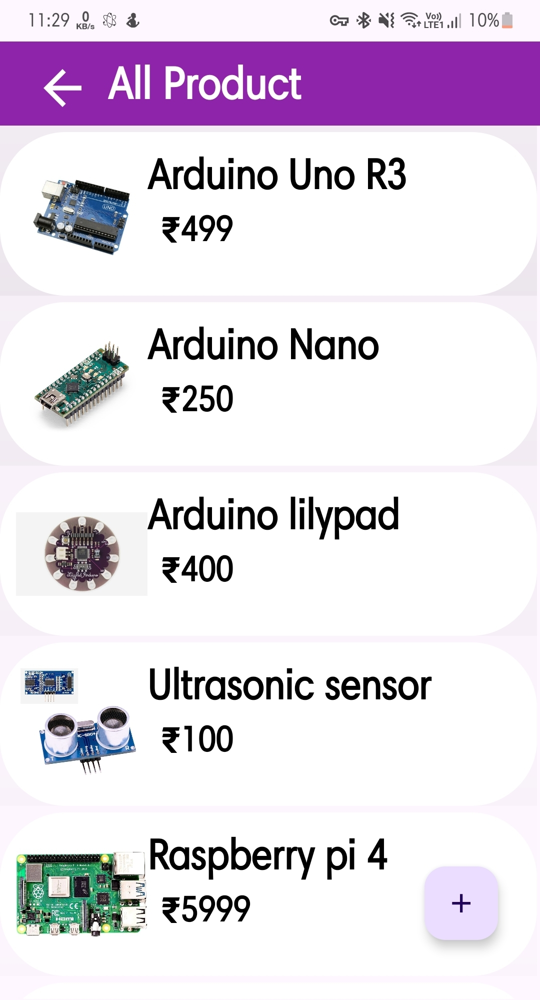
  
  
</p>
<p align="center">
  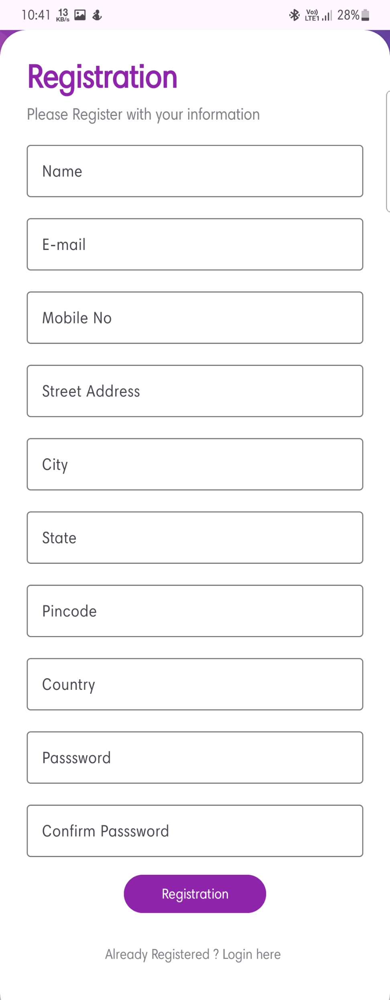
</p>

## Example Usage

- **Adding a Product:** Use the app’s UI to add new products with images and details.
- **Review & Rate:** Users submit reviews; the system analyzes sentiment and auto-assigns ratings.
- **View Products:** Browse products with ratings derived from review sentiment.
- **Update User Info:** Users can update address and profile information.
- **Image Gallery:** View slider/gallery of product and category images.

---

## Contributing

Contributions are welcome! Please fork the repository and create a pull request with your changes or improvements.

---

## License

This repository currently does not specify a license.

---

## Author

Maintained by [farmansunasara](https://github.com/farmansunasara).

---

## Contact

For questions, issues, or suggestions, please open an [issue](https://github.com/farmansunasara/Sentiment-Based-Rating-System/issues) or contact the author via GitHub.
